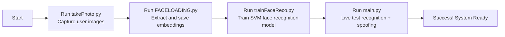

# RealFaceGuard 🎯  
**Real-Time Face Recognition & Anti-Spoofing System**

RealFaceGuard is a fully-integrated, real-time face recognition and anti-spoofing system. It combines cutting-edge deep learning models including YOLOv9 for human detection, YOLOv8-face for facial region localization, FaceNet for face embeddings, and Silence-FAS-based models for spoof detection.

> ⚠️ This project is developed by Melih Can Kesgin and is partially based on open-source projects. All external models are used with proper attribution (see License section).

---
> ✅ This project was tested with **Python 3.12**
## 🚀 Getting Started

Follow these steps to prepare and run the full real-time face recognition and anti-spoofing system:

### 1. 📸 Capture Face Images (User Registration)
Run the script below to take profile face photos (front, side, up/down):
```bash
python takePhoto.py
```

> 💡 This script saves images under `dataset/new_users/<your_name>` with guidance prompts.

### 2. 🧬 Generate Face Embeddings
After capturing images, extract facial features (embeddings) using FaceNet:
```bash
python FACELOADING.py
```

> This saves embeddings and moves verified images to `dataset/users`.

### 3. 🎓 Train the Face Recognition Model
Train an SVM classifier on the generated embeddings:
```bash
python trainFaceReco.py
```

> Outputs the model as `resources/FaceReco/svm_model_160x160.pkl`.

### 4. 🧪 Run the Real-Time Detection System
Finally, run the real-time detection, recognition, and spoof check system:
```bash
python main.py
```

> 🔍 The system detects people, locates faces, performs anti-spoofing and identifies registered users.

---

## 🧠 Usage Workflow Summary



---

## 📄 License & Attribution

This repository is licensed under the **MIT License**.

### 🔹 External Contributions

| Component | Source | License |
|-----------|--------|---------|
| Anti-Spoofing | minivision-ai/Silent-Face-Anti-Spoofing | MIT |
| FaceNet | nyoki-mtl/keras-facenet | MIT |
| YOLOv9/YOLOv10 | Ultralytics | AGPL-3.0 |

If you use this project in your research or product, please cite the original sources as applicable.

---

## ✨ Author

Developed by **Melih Can Kesgin**  
📫 Contact: melihcankesgin@gmail.com  
🔗 GitHub: github.com/MelihCan67
# RealFaceGuard
# RealFaceGuard
